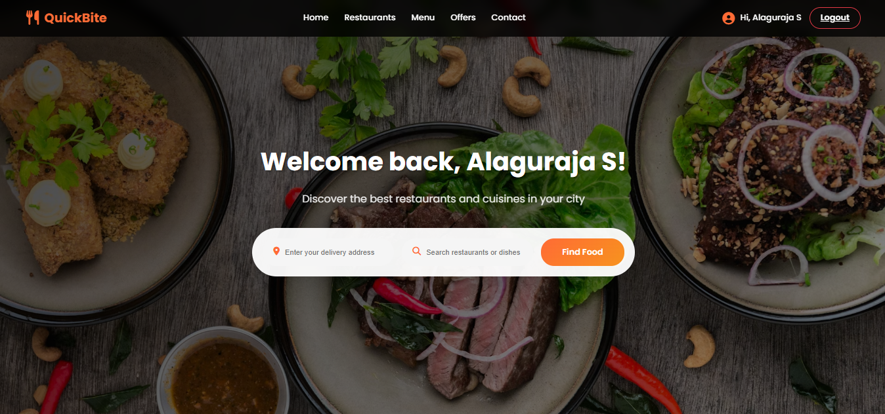
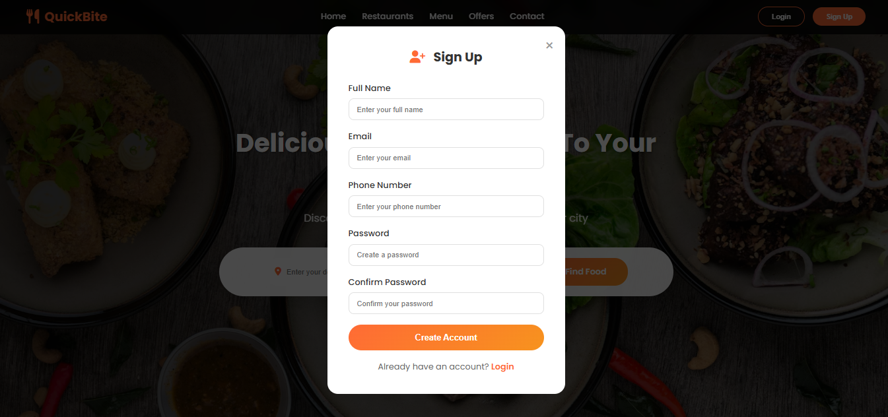
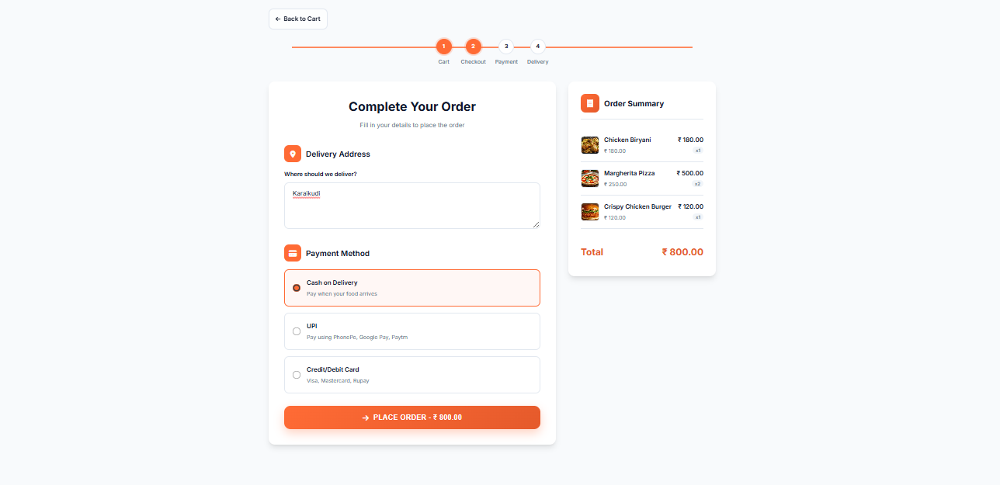

# QuickBite-Food-Order-Delivery-App
# 🍽️ QuickBite – Production-Ready Full-Stack Food Delivery Web Application

**QuickBite** is a **full-stack food delivery web application** built using **Java Servlets, JSP, JDBC, and MySQL**. It replicates the modern **Swiggy/Zomato-like experience** with:

* Responsive UI
* Smooth cart + checkout flow
* Complete order lifecycle
* Admin restaurant/menu management
* Secure authentication
* Database-driven dynamic content
* Auto-generated **PDF invoices**

Designed using a clean MVC structure, optimized SQL schema, and production-style coding patterns.

---

## 📚 Table of Contents

* [Features](#features)
* [Tech Stack](#tech-stack)
* [Project Structure](#project-structure)
* [Database Structure](#database-structure)
* [Setup & Installation](#setup--installation)
* [How It Works](#how-it-works)
* [Screenshots](#screenshots)
* [Future Enhancements](#future-enhancements)
* [License](#license)

---

## ⭐ Features

### 👨‍🍳 User Features

* User authentication (Signup/Login)
* Browse restaurants
* View menus with images, prices & descriptions
* Add/remove items to cart
* Increment/decrement quantity dynamically
* Auto-calculated subtotal & total
* Smooth checkout flow
* Place orders and track status
* Download **PDF invoice** for each order
* View order history

### 🛠️ Admin Features

* Restaurant management
* Menu item creation & editing
* Dashboard for orders
* Update order statuses (“Pending → Preparing → Out for Delivery → Delivered”)
* Download customer invoices

### 🎨 UI/UX

* Fully responsive mobile-first UI
* Clean and modern layout
* Reusable JSP components (header, footer, cards)

### 📄 PDF Invoice

* Professionally formatted invoice
* Generated via Servlet on order completion
* Includes restaurant details, tax, total amount, and item breakdown

---

## 🛠 Tech Stack

### **Frontend**

* HTML5, CSS3, JavaScript
* JSP 
* Tailwind (if applicable)

### **Backend**

* Java 17
* Java Servlets (Jakarta Servlet API)
* JSP (Java Server Pages)
* JDBC for database operations

### **Database**

* MySQL 8.x
* InnoDB storage engine
* Foreign keys & relational design

### **Tools & Libraries**

* Apache Tomcat 9 / 10
* MySQL Connector/J
* OpenPDF (for invoice generation)

---

## 📂 Project Structure

```
QuickBite/
│
├── src/main/java/com/
│   ├── controller/         # All Servlets
│   ├── dao/                # Database access layer
│   ├── model/              # POJO classes
│   ├── util/               # DB connection utility, PDF generator
│
├── src/main/webapp/
│   ├── views/              # JSP pages
│   │   ├── auth/
│   │   ├── user/
│   │   ├── admin/
│   │   └── components/     # Navbar, footer, cards
│   ├── assets/             # CSS, JS, images
│   ├── WEB-INF/
│       └── web.xml
│
├── sql/
│   └── schema.sql          # Database schema
│
├── README.md
└── pom.xml (if using Maven)
```

---

## 🗄 Database Structure

### **Tables**

* users
* restaurants
* menu_items
* cart
* cart_items
* orders
* order_items
* payments
* addresses (optional)

### ER Diagram (Text Version)

```
users (1) ----- (many) orders ----- (many) order_items ----- menu_items
restaurants (1) ----- (many) menu_items
users (1) ----- (many) cart ----- (many) cart_items ----- menu_items
```

---

## 🚀 Setup & Installation

### 1️⃣ Clone the repository

Replace `<yourusername>` with your GitHub username:

```bash
git clone https://github.com/<yourusername>/QuickBite-Food-Order-Delivery-App.git
cd QuickBite-Food-Order-Delivery-App
```

---

### 2️⃣ Import into IDE

* Use IntelliJ IDEA / Eclipse
* Configure project as a **Dynamic Web Project**

### 3️⃣ Setup MySQL Database

```sql
CREATE DATABASE quickbite;
USE quickbite;
SOURCE sql/schema.sql;
```

### 4️⃣ Update DB Credentials

Edit:

```
src/main/java/com/util/DBConnection.java
```

Update values:

```java
private static final String URL = "jdbc:mysql://localhost:3306/quickbite";
private static final String USER = "root";
private static final String PASS = "yourpassword";
```

### 5️⃣ Deploy to Tomcat

Access the app:

```
http://localhost:8080/QuickBite
```

---

## ⚙ How It Works

### **1. User Browse & Cart**

* Dynamic menu from DB
* Add/remove items
* Quantity +/– updates subtotal

### **2. Order Placement**

* Order stored in DB
* Items moved from cart → order_items

### **3. Order Status Flow**

```
Pending → Accepted → Preparing → Out for Delivery → Delivered
```

### **4. PDF Invoice**

* Auto-created after placing order
* Downloadable anytime

---

## 📸 Screenshots

(Add images in /docs folder)

```




```

---

## 🚀 Future Enhancements

* Payment gateway (Razorpay/Stripe)
* REST API (Spring Boot migration)
* Delivery partner app
* Live GPS tracking
* Push notifications (WebSockets)

---

## 📜 License

MIT License.

---

